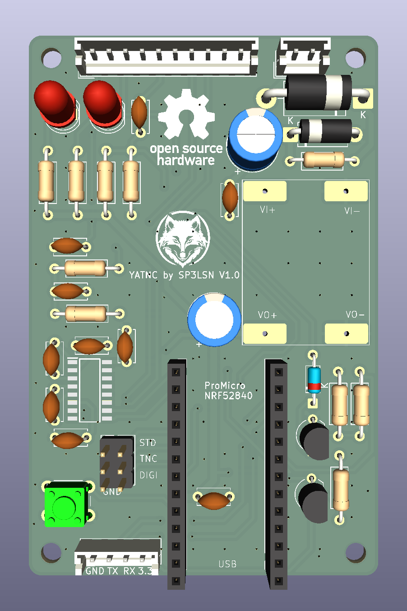
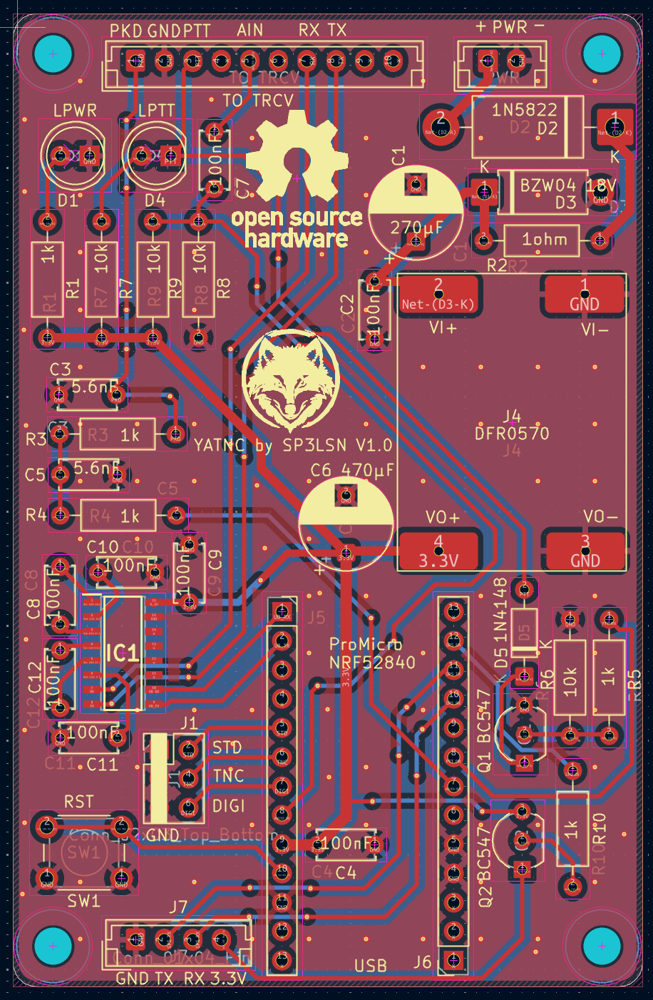

# YetAnotherTNC

Zephyr firmware (and, eventually, a companion PCB) for a nRF52840 Pro Micro
board that turns a phone's Bluetooth connection into a packet radio TNC.
Depending on how two GPIO pins are strapped at boot, the board acts as a
transparent UART↔BLE bridge, a real AX.25/KISS TNC driving 1200 baud Bell 202
AFSK audio (with optional FX.25 FEC), or an AX.25 digipeater.

> **Early stage.** This has not been widely field-tested — one unit rides in
> the author's car and works there, but it hasn't been validated across
> different radios, conditions, or by other users. Treat it as a hobby
> project that works, not a hardened product.

No app or phone-side code lives in this repo — this is the board (and PCB)
side only. Anything that speaks BLE Nordic UART Service (NUS) and either raw
KISS or TNC2 monitor lines can talk to it; see [Phone app](#phone-app) below.

## Contents

- [Why](#why)
- [Hardware](#hardware)
  - [PCB](#pcb)
  - [Pinout](#pinout)
  - [Transceiver connector (JST 10-pin)](#transceiver-connector-jst-10-pin)
  - [Bill of Materials (BOM)](#bill-of-materials-bom)
- [Operating modes](#operating-modes)
- [Known limitations](#known-limitations)
- [Phone app](#phone-app)
- [Building](#building)
- [Testing](#testing)
- [Hardware-in-the-loop (HIL) test plan](#hardware-in-the-loop-hil-test-plan)
- [Repo layout](#repo-layout)
- [License](#license)

## Why

Cheap handheld radios generally don't have a KISS/TNC mode, and dedicated TNC
hardware is either bulky or costs more than the radio. This is a ~$10 nRF52840
board wired to a radio's mic/speaker/PTT lines, doing the AFSK modem and
AX.25 framing in software, with a phone or laptop over BLE instead of a serial
cable.

## Hardware

**Primary target: Yaesu FTM510.** The board's connector is designed to match
the FTM510's mic/data jack. The **FTM400 works out of the box** — same
connector, same signals. Any other radio that can be driven by its
mic/speaker/PTT lines can work too, via a custom audio interface cable
(not covered by this repo — just the pins on the nRF52840 side).

Board: Pro Micro nRF52840 (or any nice!nano-bootloader-compatible clone,
`promicro_nrf52840` in Zephyr).

### PCB

PCB design files and bill of materials live under [`pcb/`](pcb/) (`yatnc.kicad_sch`, `yatnc.kicad_pcb`, `yatnc.csv`).

| PCB 3D Render | PCB Editor |
|:---:|:---:|
|  |  |

### Pinout

| Pin | DT node | Function | Notes |
|---|---|---|---|
| 9, 10 (P0.09/P0.10) | `uart0` | Radio RS232 (APRS data) | Level-shifted through an onboard MAX3232 to true RS-232 (±12V). Primary use: the FTM510/FTM400's own built-in APRS packet decoder outputs RS232 here in BRIDGE mode. Also works with other serial-speaking radios/modems that expect a native protocol. Never touched by firmware for anything else. |
| 31 (P0.31) | `zephyr,user` io-channel | RX audio in | ADC (AIN7), sampled at 9600 Hz for the AFSK demodulator. |
| 20 (P0.20) | `&pwm0_default` | TX audio out | Hardware PWM carrier, low-pass filtered externally into an analog tone. |
| 22 (P0.22) | `ptt_pin` | PTT out | Active-high. |
| 2 (P0.02) | `mode_pin` | Mode select | Pull-up, active-low. Grounded → PACKET_TNC. |
| 29 (P0.29) | `digi_pin` | Digipeater select | Pull-up, active-low. Grounded → DIGIPEATER (overrides pin 2). |

### Transceiver connector (JST 10-pin)

> [!IMPORTANT]
> - **RS-232 voltage levels (±12V)**: The serial lines on the 10-pin JST connector (`TO TRCV`) are true **RS-232 (±12V)** driven by the onboard MAX3232 transceiver, **not** 3.3V or 5V TTL. Do not connect them directly to logic-level UART pins!
> - **RX / TX crossover**: The RS-232 RX and TX lines **must be crossed** between the board's 10-pin JST connector and the radio (Board TX &rarr; Radio RX, Board RX &rarr; Radio TX).

| Pin | Net | Function / Description |
|:---:|---|---|
| 1 | `PKD` | TX Packet Audio (from PWM filter) |
| 2 | `GND` | Ground |
| 3 | `PTT` | PTT output |
| 4 | NC | Unconnected |
| 5 | `AUDIO TRCV` | RX Audio (to ADC demodulator) |
| 6 | NC | Unconnected |
| 7 | `RX` | RS-232 RX (±12V, connect to Radio TX — **crossed**) |
| 8 | `TX` | RS-232 TX (±12V, connect to Radio RX — **crossed**) |
| 9 | NC | Unconnected |
| 10 | NC | Unconnected |

### Bill of Materials (BOM)

Generated from KiCad BOM ([`pcb/yatnc.csv`](pcb/yatnc.csv)):

| Designator | Value / Part | Qty | Description |
|---|---|:---:|---|
| C1 | 270µF 35V | 1 | Polarized electrolytic capacitor |
| C2, C4, C7, C8, C9, C10, C11, C12 | 100nF | 8 | Ceramic disc capacitor |
| C3, C5 | 5.6nF | 2 | Ceramic disc capacitor |
| C6 | 470µF 10V | 1 | Polarized electrolytic capacitor |
| D1 | LPWR | 1 | Power indicator LED (5mm) |
| D2 | 1N5822 | 1 | Schottky diode (3A, 40V) |
| D3 | BZW04 18V | 1 | TVS transient voltage suppressor diode |
| D4 | LPTT | 1 | PTT indicator LED (5mm) |
| D5 | 1N4148 | 1 | High-speed switching diode |
| IC1 | MAX3232CDR | 1 | 3.3V/5V RS-232 transceiver (SOIC-16) |
| J1 | Conn_02x03_Top_Bottom | 1 | 2×3 pin header (2.54mm pitch) |
| J4 | DFR0570 | 1 | DFRobot DFR0570 DC-DC buck converter module |
| J5, J6 | Conn_01x13_Socket | 2 | 1×13 female socket headers (for Pro Micro nRF52840) |
| J7 | Conn_01x04_Pin | 1 | JST-EH 4-pin vertical header (2.50mm pitch) |
| PWR | Conn_01x02_Socket | 1 | JST-EH 2-pin vertical power connector (2.50mm pitch) |
| Q1, Q2 | BC547 | 2 | NPN bipolar junction transistor (TO-92) |
| R1, R3, R4, R5, R10 | 1k | 5 | Axial resistor 1kΩ (DIN0207) |
| R2 | 1ohm | 1 | Axial resistor 1Ω (DIN0207) |
| R6, R7, R8, R9 | 10k | 4 | Axial resistor 10kΩ (DIN0207) |
| SW1 | RST | 1 | Tactile push button switch (6mm) |
| TO TRCV | JST | 1 | JST-EH 10-pin vertical connector (to transceiver) |

## Operating modes

The firmware selects one of three modes at boot (and re-checks live on every
packet) by reading the mode-select and digipeater-select pins above. There is
no software switch — the mode is purely hardware-strapped, and both pins are
read fresh on every packet, so mode can in principle change at runtime by
re-wiring the straps (no latching).

Resolution order (`mode_select_get_current()` in `src/mode_select.c`):

1. `digi_pin` grounded → **DIGIPEATER**
2. else `mode_pin` grounded → **PACKET_TNC**
3. else (both floating/high, the default) → **BRIDGE**

### 1. BRIDGE (default — both pins open)

A transparent, byte-for-byte serial bridge between the radio's RS232 (UART0)
and the phone app over BLE (NUS). No AX.25/KISS parsing, no AFSK, no PTT —
just raw bytes both directions.

This is primarily for **FTM510/FTM400 radios in their own native APRS
mode**: the radio decodes AFSK itself and emits packets over RS232, and this
mode just relays that (and any outgoing data) to/from the phone app. It also
works with any other radio/modem that expects to speak its own native serial
protocol (AT commands, firmware passthrough, etc.) rather than doing AX.25
packet radio in this firmware.

- **Radio → App**: `uart_isr` (main.c) collects UART0 RX bytes into a ring
  buffer; 50ms after the line goes idle, `process_uart_to_ble()` sends
  whatever accumulated straight out over BLE notify.
- **App → Radio**: `nus_received()` queues whatever the app wrote straight to
  the TX queue; the TX thread writes it byte-by-byte to UART0 via
  `uart_poll_out()`.

### 2. PACKET_TNC (`mode_pin` grounded)

A real AX.25 KISS TNC. The app talks AX.25/KISS over BLE; the radio side is
driven as 1200 baud Bell 202 AFSK audio (with optional FX.25 forward error
correction), not raw serial.

**App → Radio (TX)**, in `tnc_process_ble_bytes()`:

1. Bytes from BLE are fed into a persistent KISS decoder. A full KISS frame
   (`FEND ... FEND`) is only acted on once its closing `FEND` has actually
   arrived — a frame split across several BLE writes (common: phones write
   in ~20-byte ATT chunks before MTU negotiation) is reassembled correctly
   before anything is sent.
2. Most phone APRS apps don't actually KISS-frame anything — they write a
   human-readable **TNC2 monitor line** instead, e.g.
   `SP3LSN-9>APVEC0,WIDE1-1,WIDE2-1:!5227.76N/01654.03E>comment`. If nothing
   KISS-decodes within 250ms of the app going idle, `tnc_send_raw_frame()`
   tries `ax25_parse_monitor()` on the accumulated bytes; on success it
   builds a real binary AX.25 UI frame (proper shifted-ASCII addresses,
   control/PID, FCS) instead of transmitting the raw text. If it doesn't
   parse either way, the bytes are assumed to already be a raw AX.25 frame
   and sent as-is.
3. If a stray `FEND` byte appears in non-KISS app data (e.g. a Latin-1
   accented character in an APRS comment happens to be `0xC0`) and never
   gets a matching closing `FEND`, the KISS decoder used to wedge itself
   in-frame forever, silently swallowing everything after it. It now
   self-resets after the same 250ms idle window instead.
4. Every queued frame is picked up by the TX thread: PTT keys (pin 22,
   active-high), the frame is modulated to AFSK PCM (`AFSKModulator`, with
   FX.25 RS(255,239) wrapping if enabled via `audio_tx_set_fx25(true)` —
   off by default, no live control path wired to it yet), the waveform is
   played out on pin 20 via the nRF52840's hardware PWM, then PTT unkeys.

**Radio → App (RX)**, two independent sources feed the same BLE output:

- **Audio demodulation**: a dedicated thread samples pin 31 (ADC, AIN7) at
  9600Hz through `AFSKDemodulator` (bandpass filter → frequency discriminator
  → DPLL bit recovery → HDLC flag/destuff, with an FX.25 correlation-tag
  correlator running in parallel that transparently Reed-Solomon-corrects a
  frame if the sender wrapped it in FX.25). A decoded frame is KISS-wrapped
  and sent over BLE.
- **UART0**: if the radio/modem itself emits KISS bytes over serial rather
  than raw audio, `tnc_process_radio_bytes()` decodes and forwards those the
  same way.

### 3. DIGIPEATER (`digi_pin` grounded, overrides `mode_pin`)

Everything PACKET_TNC does, plus: every frame heard on the radio is checked
for an un-repeated `WIDEn-N`/`DIGI` hop in its path
(`digipeat_process_frame()`). If found, the hop's SSID is decremented (H-bit
set once it reaches 0, marking it used) and the frame is re-encoded and
re-transmitted back out over radio — a standard WIDEn-N digipeater. The frame
is forwarded to the BLE app either way, repeated or not, so the app sees
everything heard on the channel.

## Known limitations

- **AFSK decode is functional but not polished.** It works, but weak-signal
  / low-level decode robustness needs more work — expect some missed frames
  on marginal audio until the demodulator gets more tuning.
- **Not widely field-tested.** Verified on the bench and in one car; not yet
  validated across multiple radios, RF conditions, or users.
- FX.25 TX wrapping has no live control path yet (`audio_tx_set_fx25`, code
  only).

## Phone app

Developed and tested against **[aprsvector](https://aprsvector.ores.one)**
(also by the author) — that's the reference app for this firmware and the
one to reach for first.

More generally, anything that speaks BLE Nordic UART Service (NUS) and
either raw KISS or TNC2 monitor lines *should* work (most Android APRS apps
fit this description), but only aprsvector has actually been tested against
this firmware.

## Building

```sh
./build.sh
```

First run creates a `.venv`, pulls a Zephyr workspace into `zephyrproject/`
(via `west`), and builds for `promicro_nrf52840`. Later runs reuse both, so
they're much faster. Pass anything after the script name straight through to
`west build` if you need non-default args:

```sh
./build.sh -b promicro_nrf52840 --pristine
```

Set `ZEPHYR_SDK_INSTALL_DIR` if the script can't find your SDK on its own; it
looks in the usual spots (`~/zephyr-sdk-*`, `/opt/zephyr-sdk-*`, etc).

Output is `build/zephyr/zephyr.uf2`. To flash: double-tap the board's reset
button to drop into the UF2 bootloader (it'll show up as a USB drive), then
copy the file over. `bootloader/` has the nice!nano bootloader itself, for
boards that don't already have one.

## Testing

```sh
./run_tests.sh
```

Builds and runs the host-side unit tests for everything that doesn't touch
Zephyr or real hardware — AX.25, KISS, FX.25, and the AFSK modem DSP — and
fails if line coverage on any of those drops below 80%. `tnc.c`, `main.c`,
`ptt.c`, `mode_select.c`, and the audio drivers aren't covered here; they need
a board, see [HIL test plan](#hardware-in-the-loop-hil-test-plan).

There's also a Python reference model of the AFSK modem
(`tools/afsk_dsp.py`, tested by `tools/test_afsk.py`/`pytest`) used to
sanity-check the C++ implementation and to generate/analyze WAV captures
independent of the firmware.

## Hardware-in-the-loop (HIL) test plan

`run_tests.sh` covers the Zephyr-free pure-logic modules (AX.25, KISS, FX.25,
AFSK modem DSP) at ≥80% line coverage on host. It cannot touch anything that
only exists on real silicon: GPIO strapping, hardware PWM audio out, ADC
audio in, UART timing, or BLE NUS. Those need the actual `promicro_nrf52840`
board. This is a plan, not a runnable suite yet — no board rig is set up for
automated HIL runs.

What each untestable-on-host module needs:

1. **`mode_select.c`** — ground/float P0.02 and P0.29 in each of the 4
   combinations, reboot, confirm `mode_select_get_current()`/boot log report
   BRIDGE / PACKET_TNC / DIGIPEATER correctly, and that re-strapping is
   picked up live (no latching).
2. **`ptt.c`** — scope P0.22 across a TX; confirm it goes active-high only
   for the duration `audio_tx_pwm` is actually playing samples, and idles
   low the rest of the time (a PTT stuck high keys the radio permanently).
3. **`audio_tx_pwm.cpp`** — scope P0.20; confirm the PWM carrier frequency
   and the external low-pass filter actually pass 1200/2200 Hz clean and
   knock the PWM carrier down enough that an external TNC (or this board's
   own RX path, looped back) decodes it.
4. **`audio_rx_adc.cpp`** — feed a known AFSK signal into P0.31 (from a
   signal generator, or TX pin of a second unit looped back through the
   filter) and confirm frames make it out over BLE.
5. **RS232 bridge (BRIDGE mode, `main.c`)** — with a real FTM510/FTM400 (or
   other serial device) on P0.09/P0.10 through the onboard MAX3232, confirm
   byte-for-byte passthrough both directions and the 50ms idle-flush timing.
6. **BLE NUS end-to-end** — a phone/PC BLE client sends a KISS frame or
   TNC2 monitor line; confirm it comes out the radio side per the routing
   already unit-tested at the `ax25.c`/`kiss.c` level, and vice versa.
7. **Full loop**: two boards, one PACKET_TNC and one DIGIPEATER, over actual
   RF or a dummy-load/attenuator link — confirms the whole AFSK+FX.25+KISS
   stack end to end, not just each half in isolation on host.

Implementing an automated HIL rig (e.g. Zephyr `twister --hardware-map`) is a
follow-up once there's dedicated bench hardware for it; for now these are run
by hand.

## Repo layout

```
src/            firmware source (Zephyr app)
tools/          host-side Python tooling (AFSK reference model, WAV decoder, log capture)
app.overlay     devicetree overlay: GPIO straps, ADC channel, PWM pin
prj.conf        Zephyr/Kconfig options
CMakeLists.txt  build target sources
build.sh        one-shot Zephyr workspace + build
run_tests.sh    host-side unit tests + coverage
bootloader/     nice!nano UF2 bootloader images
pcb/            KiCad board design files and BOM (yatnc.kicad_sch, yatnc.kicad_pcb, yatnc.csv)
images/         PCB 3D render and layout editor screenshots
```

Other tools in `tools/`:

- `decode_aprs.py` — decodes AX.25/APRS frames out of a captured WAV file, for checking a TX recording without a second TNC.
- `capture_log.ps1` — tails the board's USB serial console to a timestamped log file, reconnecting automatically across board resets (handy for catching a crash dump).

## License

`src/main.c` carries an `SPDX-License-Identifier: Apache-2.0` header; treat
the rest of the firmware the same way unless noted otherwise.
